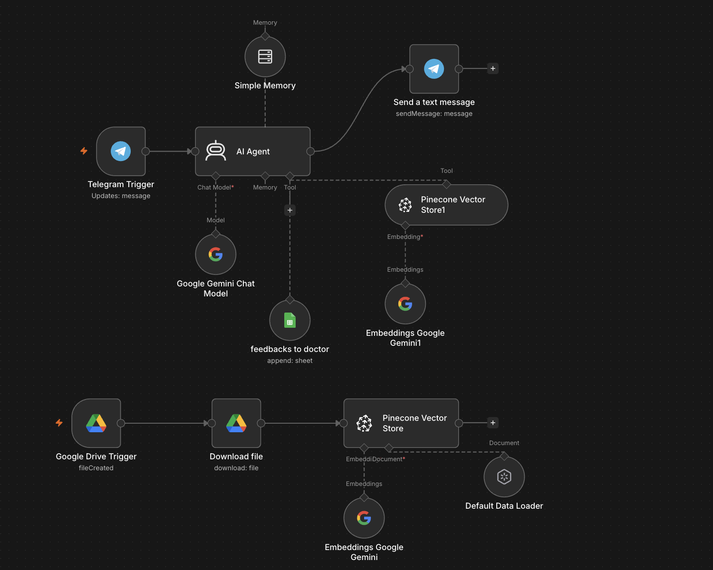

# RAG AI Assignment Assistant

An n8n-powered Telegram assistant that answers student questions about assignments, reviews submitted solutions against instructor-provided references, and logs detailed feedback for instructors.

## Table of contents

- [What it does](#what-it-does)
- [How it works](#how-it-works)
- [Workflow nodes](#workflow-nodes)
- [How the agent enforces assignment policy](#how-the-agent-enforces-assignment-policy)
- [Tech stack](#tech-stack)
- [Setup](#setup)
- [Add assignment materials](#add-assignment-materials)
- [Student interaction](#student-interaction)
- [Project structure](#project-structure)
- [License](#license)

## What it does

**Assignment knowledge base (ingestion):**

- Watches a Google Drive folder named `RAG` for new assignment files.
- Downloads each new file and prepares it with n8n's Default Data Loader.
- Creates embeddings with Google Gemini and stores the documents in Pinecone.
- Makes assignment requirements and instructor reference solutions available to the agent through retrieval.

**Student support and grading (Telegram):**

- Receives student messages through a Telegram bot.
- Retrieves assignment context from Pinecone for each message.
- Answers questions about assignment requirements without revealing the model solution.
- Reviews student submissions against retrieved course materials and asks for the student's name and code when needed.
- Sends a supportive Telegram reply and logs the submission, rating, and detailed instructor feedback to Google Sheets.

## How it works



Add a reviewed screenshot of the n8n canvas as `assets/workflow-diagram.png`.

```text
ASSIGNMENT INGESTION

Google Drive folder (RAG)
          │ new file
          ▼
    Download file
          │
          ▼
 Default Data Loader ────── Google Gemini Embeddings
          │                           │
          └──────────────┬────────────┘
                         ▼
                 Pinecone index
                  rag-ai-agent

STUDENT SUPPORT

Telegram Trigger ──► AI Agent ──► Send Telegram reply (HTML)
                         │
          ┌──────────────┼─────────────────┐
          ▼              ▼                 ▼
    Google Gemini   Simple Memory    Pinecone retrieval
     Chat Model     (per chat ID)       (assignment RAG)
                         │
                         └──► Google Sheets logging tool
```

The export uses n8n's Default Data Loader; add or configure a text splitter in the document-loading path if you need explicit chunk sizes or overlap for your materials.

## Workflow nodes

| Node | Role |
| --- | --- |
| `Google Drive Trigger` | Polls the selected Drive folder every minute for new files. |
| `Download file` | Downloads the newly created assignment file. |
| `Default Data Loader` | Loads file content for the vector-store ingestion path. |
| `Embeddings Google Gemini` | Embeds documents for Pinecone ingestion. |
| `Pinecone Vector Store` | Inserts assignment documents into the `rag-ai-agent` index. |
| `Telegram Trigger` | Receives student messages. |
| `AI Agent` | Retrieves assignment context, answers questions, and handles submissions according to its system prompt. |
| `Google Gemini Chat Model` | Provides the agent's language model. |
| `Simple Memory` | Keeps short-term conversation context per Telegram chat ID. |
| `Pinecone Vector Store1` | Exposes assignment retrieval as a tool to the agent. |
| `Embeddings Google Gemini1` | Embeds retrieval queries for Pinecone. |
| `feedbacks to doctor` | Appends submission details, rating, and technical feedback to Google Sheets. |
| `Send a text message` | Sends the student-facing response using Telegram HTML parse mode. |

## How the agent enforces assignment policy

The AI Agent is instructed to act as an assignment-support and review assistant, not as an unrestricted chatbot:

- **Knowledge-base first:** retrieve relevant assignment material before responding; do not guess when the knowledge base has no relevant information.
- **Protect the model solution:** explain assignment requirements, but do not reveal, hint at, or paraphrase the model solution in student-facing answers.
- **Submission details:** request the student's name and code if they have not already provided them in the conversation.
- **Instructor-only grading details:** compare a submission with the retrieved model solution, produce a 0–10 rating and specific technical notes, then send both to the instructor sheet.
- **Motivational student reply:** do not disclose the score or technical comparison to the student.
- **Telegram formatting:** return HTML supported by Telegram's parse mode; do not use Markdown formatting.
- **Same-language replies:** respond in Arabic or English to match the student's language.

The AI Agent prompt asks it to call the logging tool and send a student reply for every submission. Check n8n execution history and the Sheet to confirm both actions completed.

## Tech stack

- **Automation:** n8n
- **Chat model and embeddings:** Google Gemini
- **Vector database:** Pinecone
- **Assignment storage:** Google Drive
- **Instructor reporting:** Google Sheets
- **Student interface:** Telegram Bot API

## Setup

### Prerequisites

- An n8n instance with Google Drive, Google Sheets, Telegram, Google Gemini, Pinecone, and LangChain nodes available.
- A Telegram bot token.
- A Google Gemini API key.
- A Pinecone API key and project.
- Google OAuth credentials authorized for the Drive folder and spreadsheet.

### Import and configure

1. Import [`rag-ai-assignment-assistant.json`](./rag-ai-assignment-assistant.json) into n8n. For a self-hosted instance with the n8n CLI installed:

   ```bash
   n8n import:workflow --input=rag-ai-assignment-assistant.json
   ```

2. Create credentials in n8n and select them in the matching nodes. The public workflow file does not include credential references:

   | Credential | Nodes |
   | --- | --- |
   | Google Drive OAuth2 | `Google Drive Trigger`, `Download file` |
   | Google Gemini API | `Google Gemini Chat Model`, both `Embeddings Google Gemini` nodes |
   | Pinecone API | Both `Pinecone Vector Store` nodes |
   | Telegram API | `Telegram Trigger`, `Send a text message` |
   | Google Sheets OAuth2 | `feedbacks to doctor` |

3. Create a Pinecone index named **`rag-ai-agent`**. Configure its dimensions to match the Gemini embedding model selected in n8n, then select this index in both Pinecone nodes.
4. Create a Google Drive folder named **`RAG`**, authorize n8n to access it, and select it in `Google Drive Trigger`.
5. Create the instructor Google Sheet and configure its spreadsheet and sheet in `feedbacks to doctor`.
6. Configure the Telegram Trigger webhook, activate the workflow, and test it with sample assignment material and a test student account before sharing it.

The workflow JSON uses placeholders for the Drive folder ID, spreadsheet ID, and sheet ID. JSON does not support comments; their names identify their purpose. Select your own Drive folder and Sheet in the corresponding n8n nodes after import. Credential references, Telegram webhook IDs, and n8n instance-specific metadata are omitted and will be configured by your n8n instance.

### Google Sheets columns

Create the sheet with these columns:

| Name | Code | Assigment Name | solution | Rate | Feedback |
| --- | --- | --- | --- | --- | --- |

The spelling `Assigment Name` matches the current workflow prompt. The exported node maps the rating field to `Rate ` (with a trailing space); if your column is exactly `Rate`, update the column mapping in `feedbacks to doctor` and refresh its schema after import.

## Add assignment materials

- Upload text-searchable PDF, DOCX, or plain-text files supported by your n8n document loader to the watched Drive folder.
- Keep one assignment per clearly named file; avoid combining unrelated assignments in one document.
- Label the assignment title, question, requirements, and model solution clearly. Keep instructor reference solutions in access-controlled Drive storage.

Example document structure:

```text
Assignment: Assignment 1

Question
[Assignment prompt and requirements]

Model solution
[Instructor reference solution]
```

The Drive trigger polls every minute for newly created files. Check the n8n execution history after an upload to confirm successful ingestion into Pinecone.

## Student interaction

Students can ask questions about an assignment or submit their work through the Telegram bot. For submissions, the agent should first request the student's name and code if they are not yet known in the current chat.

```text
Student: What does Assignment 1 ask me to do?
Bot: Assignment 1 asks you to ... [requirements explained without revealing the solution]

Student: My name is Alex and my code is A102. Here is my solution: ...
Bot: ✅ Assignment: Assignment 1
     📝 تم استلام حلك بنجاح!
     Great effort—review the assignment requirements before your next submission.
```

The score and detailed technical feedback are intended for the instructor's Google Sheet, not for the student's Telegram reply.

## Project structure

```text
.
├── .gitignore
├── README.md
├── rag-ai-assignment-assistant.json
└── assets/
    └── workflow-diagram.png   # Add a reviewed n8n canvas screenshot
```

The original unsanitized workflow export and local screenshots are excluded from version control. Add only a reviewed screenshot under `assets/`; do not publish the original export or screenshots containing private instance details.

## License

Not specified yet. Add a license and its full text before redistributing this project.
